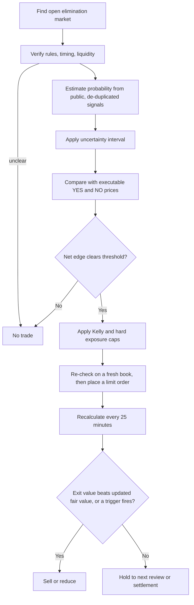

# Elimination-market mispricing engine

An autonomous, shadow-mode-first trading system for reality-TV elimination
markets on Kalshi and Polymarket. It runs unattended on a timer, forms its own
probability estimates from **public information only**, compares them to live
prices net of every cost, and records everything it saw and did.

It does not place real orders. That is deliberate, and it is the single most
important design decision in the package — see [Live trading](#live-trading).

## What one cycle does

```
discover -> quote -> verify the contract -> collect public signals
         -> estimate with an uncertainty interval -> manage open positions
         -> price new entries -> re-check at the last moment -> record
```

| Stage | Module | What happens |
|---|---|---|
| Discover | `venues/kalshi.py`, `venues/polymarket.py` | Open markets whose titles read as "who goes home", not "who wins" |
| Quote | same | Full order book per market, normalised to probabilities |
| Verify | `contract.py` | Episode, definition of "eliminated", edge cases, close time, resolution source. Unclear terms mean no trade |
| Signals | `signals/` | Public research + cross-venue divergence, each with a citable URL |
| De-duplicate | `correlation.py` | Repetitions of one rumour collapse into a single claim |
| Estimate | `probability.py` | Market price is the prior; weighted, de-duplicated signals shift it in log-odds; the episode's legs are renormalised to sum to one elimination |
| Bound | `uncertainty.py` | A probability interval, not a point. Each side is judged against its pessimistic end |
| Edge | `edge.py`, `fees.py` | Walk the book for the intended size at executable prices, subtract current exchange fees |
| Exits | `exits.py` | Sell when the exit price beats the updated value of holding, or when a risk trigger fires |
| Policy | `policy.py` | Entry gates; a pass is recorded with its reason |
| Size | `sizing.py` | Quarter Kelly, then per-market / per-episode / per-cycle / gross / liquidity caps |
| Pre-flight | `engine.py` | Re-quote and re-check immediately before sending; resize down, never chase up |
| Execute | `broker.py` | Paper fills against the captured book, with an adverse-selection haircut |
| Record | `storage.py` | SQLite, append-only, exportable as JSONL |

Exits run before entries, so capital and exposure freed by a sale are
available to the best new idea in the same cycle — but a market exited this
cycle is off-limits until the next one, because flipping sides 25 minutes
apart on the same evidence is churn, not conviction.

## Verify the contract before analysing it

`contract.py` reads the terms first and refuses anything ambiguous:

* **which episode** the contract covers (title first — rules text is often
  shared boilerplate that names a different one);
* **what "eliminated" means**, and whether withdrawal, a quit,
  disqualification, medical evacuation, a double elimination, a
  non-elimination week, a tie or a postponement are addressed. A term counts
  as addressed only when the rules both mention it *and* say how it resolves;
* **closing time**, present and still in the future;
* **market status**, open and not already settled;
* **whether the episode has already aired** somewhere;
* **the official resolution source**.

Every check is recorded in the `verifications` table, pass or fail. A
contract that later stops verifying is not merely un-tradeable: it forces an
exit from any position already held in it, because a position whose
settlement rule you can no longer read is not a position you understand.

## Conservative probability, not a point estimate

A model that says "65%" and trades on 65% is claiming a precision it does not
have. Every estimate therefore carries an interval (`uncertainty.py`), and
each side is bought against its pessimistic end:

* buying YES uses the **low** bound;
* buying NO uses **1 − high**.

The half-width grows with few independent claims, unproven sources,
disagreement between sources, and stale evidence. Working the example from
the spec: a point estimate of 0.65 with a 0.60–0.70 interval buys YES at
0.60, so an ask of 0.47 plus 3 points of costs plus a 5-point minimum edge
(0.55 required) still clears — but the same ask against a 0.53 conservative
bound does not, even though 0.53 is above the market's 0.47.

Intervals are built in log-odds space, so they never leave (0, 1) and a
6-point band around 0.50 does not become a 6-point band around 0.03.

## Five sites repeating one rumour are one signal

`correlation.py` groups signals into independent claims — by an explicit
syndication map, then by URL domain, then by near-identical claims made close
together — and collapses each group to one effective signal: the strongest
member at full weight, each repetition at a geometrically decaying fraction
(a quarter, then a sixteenth, …). A cluster converges to about 1.33× its lead
member and never to 2×, so five echoes of one rumour can never outweigh two
genuinely independent sources. The effective-source count feeds straight into
the uncertainty interval, so repetition widens the band rather than narrowing
it.

## Information policy

Only lawful public information reaches the model. This is enforced in code,
not in a comment: every signal carries an `access` field, and
`signals/base.py:PublicInfoPolicy` drops anything that is not `public` or
`licensed`, or that arrives without a citable URL. Dropped signals are
recorded as dropped — the audit log shows both that the information was
offered and that it was refused.

What that rules out: insider information, confidential or NDA-covered
material, hacked or stolen material, and paywalled material used without
permission. Kalshi prohibits trading on material non-public information and
screens for it. What it leaves in is the interesting part anyway: publicly
posted spoilers, open fan polls, social sentiment, press interviews, previews,
edit analysis, and the venues' own public order flow.

Public research is hand-entered as structured JSON (see
`tests/fixtures/example_research.json`) rather than scraped indiscriminately,
so the provenance of every input is legible and a collector cannot quietly
start ingesting something it should not.

## The source-reliability database

`signals/registry.py` grades every signal against the outcome of the market it
spoke about, scoring the probability the source *implied* relative to the
market prior at the time. Those Brier scores set the weights in
`probability.source_weight`:

* an unproven source carries weight 0.1 and barely moves a price;
* a source no better than a coin flip (Brier ≥ 0.25) is driven to zero;
* weight grows with a shrinkage factor `n / (n + 20)`, so it has to earn trust
  across many episodes rather than one lucky call.

This is the asset worth building. A measured record of which public spoiler
sources actually predict, and how fast markets absorb them, is more durable
than any single model.

## Risk policy

Defaults in `config/elimination_bot.example.json`:

| Gate | Default | Why |
|---|---|---|
| `min_net_edge` | 0.10 | Ten points after fees, spread and slippage, measured from the conservative bound |
| `safety_margin` | 0.0 | Extra reserve on top of the interval; the interval is the primary mechanism |
| `max_signal_age_hours` | 96 | Evidence older than this cannot open a position |
| `max_spread` | 0.06 | No wide, illiquid books |
| `min_top_of_book_size` / `min_depth_contracts` | 25 / 100 | Real liquidity only |
| `max_book_participation` | 0.25 | Never take more than a quarter of visible depth |
| `kelly_fraction` | 0.25 | Quarter Kelly or less |
| `max_fraction_per_market` | 0.02 | 2% of bankroll per contestant |
| `max_fraction_per_group` | 0.05 | 5% per episode |
| `max_fraction_per_cycle` | 0.05 | 5% per 25-minute cycle |
| `max_gross_exposure` | 0.30 | 30% at risk in total |
| `min_minutes_to_close` | 20 | No lottery tickets at the bell |
| `max_days_to_close` | 21 | No capital parked for a month |
| `max_drawdown` | 0.20 | Stop trading after −20% |

The entry rule, stated once:

> conservative probability > executable price + fees + slippage + minimum edge

The executable price is the VWAP of actually walking the book for the intended
size — never the midpoint. Backtesting against midpoints is the single easiest
way to manufacture an edge that does not exist.

Two kill paths, both files on disk because that is the mechanism least likely
to fail: `data/KILL_SWITCH` stops trading immediately, `data/DORMANT` marks the
system paused. A drawdown breach is different: it stops new entries but leaves
exits available, because a circuit breaker that also freezes the sell side
locks you into the positions that tripped it.

## Selling

`exits.py` runs the entry rule backwards:

> net proceeds (bid, walked, minus fees and exit slippage) − fair value of
> holding > `min_exit_edge`

Fair value of an open position is taken from the **optimistic** end of the
interval — the opposite end from the one used to buy — so exiting requires the
market to beat even the generous case for holding. Both rules are pessimistic
about the action being taken, which is what makes "do nothing" the usual
answer.

Two worked cases, both from the spec and both covered by tests:

* Bought at 0.47; the estimate falls to 0.49 and the bid is 0.56 (0.55 net).
  0.55 − 0.49 = +0.06 → **sell**. The gain from 0.47 is not the reason; the
  contract is simply overpriced against the updated estimate.
* Bought at 0.47; the estimate is 0.72 and the bid is 0.65 (0.64 net).
  0.72 > 0.64 → **hold**, despite the paper profit.

Beyond that expected-value rule, these triggers force an exit or a reduction:

| Trigger | Action | Why |
|---|---|---|
| `emergency_loss_limit` | close | Hard bound on being wrong; the one non-EV rule |
| `contract_ambiguity` | close | Settlement terms no longer verify |
| `source_invalidated` | close | The principal source retracted or was discredited |
| `operational_failure` | close | Database, clock, API or price-validation problem |
| `approaching_close` | close | Data and execution can no longer be verified near airtime |
| `signal_reversal` | reduce, or close below the exit price | The central estimate fell materially since entry |
| `stale_evidence` | reduce | Sources have not updated inside the permitted interval |
| `risk_limit` | reduce | Episode-wide correlated exposure above its cap |
| `drawdown_circuit_breaker` | reduce near fair value | Portfolio losses crossed the limit |
| `better_opportunity` | reduce | Capital is constrained and an independent opportunity is clearly better — **off by default**, because rotation costs turnover |

`signal_reversal` exists because the expected-value rule alone would miss it:
holding is valued at the optimistic end of the interval, so evidence can turn
against a position without the bid ever looking generous.

What the module deliberately does **not** do is sell on a price move. A 20%
drop in a thin prediction market is often one small order, not new
information. A price move triggers reassessment; only a change in fair value,
a risk limit, or a genuinely better exit price triggers a sale. The same
applies upward — there is no fixed profit target. Forced exits still respect
a price floor (`max_forced_exit_slippage`) rather than dumping into a hole.

## The last-moment re-check

Between deciding and submitting, the ask can move, the size can vanish, the
market can close, or the kill switch can be thrown. Before any order is sent
the engine re-quotes that one market and re-runs the checks: kill switch and
dormancy, no existing or just-closed position, contract still verified, still
far enough from the close, and the whole edge calculation again on the fresh
book. If the book has thinned the order is **resized downwards**; if the price
has run away the order is **dropped**. The engine never chases a price it has
already rejected, and a partial fill is recorded as what it was — the next
cycle re-evaluates from scratch.

## Fees are data that expires

A hard-coded fee rate is a silent time bomb: the venue changes its schedule,
the constant does not, and every edge calculation is quietly wrong in the
direction that loses money. Rates live in `data/fee_schedule.json` with the
date they were last checked against the venue's published schedule. Once that
check goes stale (90 days by default) the engine warns on every cycle in
shadow mode and refuses to trade live at all.

```bash
python -m elimination_bot.cli fees                   # show rates and their age
python -m elimination_bot.cli fees --verified-today  # after checking the venue's schedule
```

## Funding, and what happens when the bill goes unpaid

Hosting money lives in a prepaid operating reserve — twelve months by default,
warning at six — and is topped up **only from realized profit**, never from
trading margin (`funding.py`). Settlement and withdrawal delays make week-to-
week self-funding unreliable, so the reserve absorbs the timing mismatch.

If the reserve runs out the system goes **dormant**: cancel resting orders,
stop placing new ones, write a marker file explaining why, and preserve the
database, the logs and the code exactly as they are. Nothing is deleted.
A system that destroys its own audit trail when a card declines is unauditable
by design, and creates security, accounting and debugging problems precisely
when you most need the records. `cli.py resume` lifts dormancy.

## Live trading

`broker.LiveBroker` raises `LiveTradingDisabled` on every order. Wiring a
venue's signed order endpoint is a small amount of code and a large amount of
responsibility; it belongs to whoever has read a full shadow season's results,
and it should be written and tested against a funded account, not shipped
ahead of the evidence.

Both venues do support programmatic order placement, and the interface it
would implement is already defined (`broker.Broker`). Nothing about the rest
of the system changes when that day comes: the same decisions, the same caps,
the same log.

Note also what autonomy does and does not mean here. The exchange account, the
billing relationship and the legal responsibility remain the operator's. The
bot is autonomous operationally, not legally independent, and eligibility and
tax treatment are the operator's to check in their own jurisdiction.

## Shadow protocol and the go-live bar

Run at least one complete season in shadow mode. `evaluate.readiness_report`
measures the bar and reports each criterion with its measured value:

1. ≥ 150 independent trade opportunities (100–200 is the working range)
2. Positive total PnL after fees and realistic slippage
3. Profitable across at least two shows or seasons
4. Expected calibration error ≤ 0.10 — "70%" predictions win about 70% of the time
5. The largest single trade is ≤ 35% of total PnL
6. No single contestant is > 50% of positive PnL
7. No single source touches > 50% of traded markets
8. Bootstrap 95% CI on mean PnL per trade excludes zero
9. The chronological holdout tail (last 30%, ≥ 20 trades) is profitable

`python -m elimination_bot.cli readiness` exits non-zero until all nine pass.

## Running it

```bash
pip install -r requirements-elimination-bot.txt
cp config/elimination_bot.example.json config/elimination_bot.json

# what is trading right now, and which contracts are readable
python -m elimination_bot.cli --config config/elimination_bot.json discover
python -m elimination_bot.cli --config config/elimination_bot.json verify -v

# one shadow cycle — this is what the timer calls
python -m elimination_bot.cli --config config/elimination_bot.json cycle -v

# after an episode airs
python -m elimination_bot.cli --config config/elimination_bot.json settle outcomes.json
python -m elimination_bot.cli --config config/elimination_bot.json sources --regrade
python -m elimination_bot.cli --config config/elimination_bot.json readiness

# open positions and what the exit rule says about each
python -m elimination_bot.cli --config config/elimination_bot.json positions

# operations
python -m elimination_bot.cli --config config/elimination_bot.json status
python -m elimination_bot.cli --config config/elimination_bot.json fees
python -m elimination_bot.cli --config config/elimination_bot.json fund --deposit 480
python -m elimination_bot.cli --config config/elimination_bot.json pause --reason "manual"
python -m elimination_bot.cli --config config/elimination_bot.json export --out shadow/export
```

Offline, add `--fixture tests/fixtures/example_episode.json` to any command to
run the whole pipeline against a recorded episode with no network access.

`outcomes.json` is `{"outcomes": [{"market_key": "kalshi:ELIM-...", "subject":
"Alex", "eliminated": true}]}`.

Every 25 minutes, via `.github/workflows/elimination-shadow.yml` (scheduling
commented out by default — a 25-minute cron commits to the repo ~57 times a
day) or a cron line on any small host:

```
*/25 * * * * cd /srv/bot && python -m elimination_bot.cli --config config/elimination_bot.json cycle >> logs/cycle.log 2>&1
```

## The decision sequence



The heart of it: buy when the conservative probability is materially higher
than the executable price after all costs; sell when the executable exit
value is materially higher than the updated value of continuing to hold;
otherwise do nothing. "Do nothing" should be, and in the fixtures is, by far
the most common outcome.

## Tests

```bash
python -m unittest discover -s tests
```

No third-party test dependency; `requests` is the only runtime one, and the
fixture venue means the suite never touches the network.

## Honest expectations

The engine is straightforward to operate. Whether it makes money is a
different question, and the honest prior before seeing data is not encouraging:
occasional profitable trades are likely, net profitability over one season is
maybe a coin flip, sustained profitability across several seasons is unlikely,
and reliably paying its own expenses from weekly profits is less likely still.

The reasons are structural, not fixable by better code:

* Fan predictions and public spoilers are often already in the price.
* Public spoilers are frequently wrong, deliberately misleading, or the same
  single unreliable claim echoed by a dozen accounts — correlated sources look
  like confirmation and are not.
* Elimination markets are small: wide spreads, thin books, and not enough
  capacity to turn even a real edge into real money.
* A good probability model still loses through timing and sizing.
* One genuine spoiler can make a season look successful without a repeatable
  strategy behind it.
* Any public source that proves predictive gets priced in by others quickly.

Treat this as a measurement instrument first and a trading system second. The
readiness report exists to make "it worked" a claim with evidence behind it,
and to make staying in shadow mode the default outcome rather than a failure.
